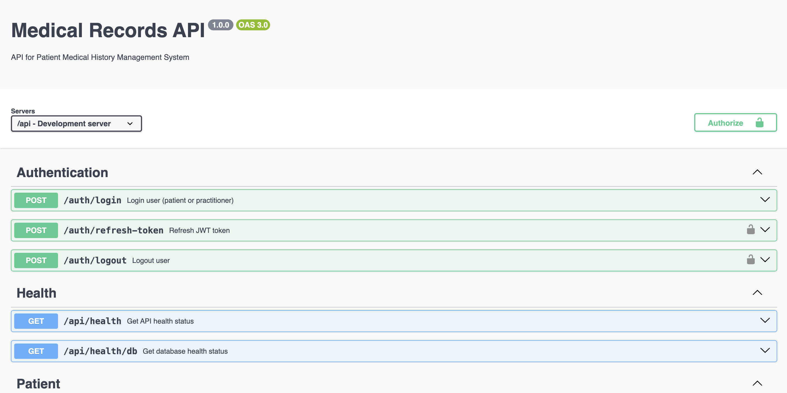

# 🏥 eFiche API - Medical Records Management System

A robust and scalable REST API for managing medical records, built with modern technologies and best practices.




## 🚀 Quick Start

```bash
# Clone the repository
git clone <git@github.com:Jaman-dedy/medical-records-api.git>

# Start all services
make up

# View logs
make logs

# Access API shell
make shell

# Access database shell
make db-shell
```

## 🛠️ Technology Stack

- **🔧 Core:**
  - Node.js & TypeScript
  - Express.js
  - PostgreSQL
  - TypeORM

- **🔐 Security:**
  - JWT Authentication
  - Role-based Access Control
  - Data Validation with Zod

- **☁️ Storage:**
  - Cloudinary for Files
  - PostgreSQL for Data

- **🐳 DevOps:**
  - Docker & Docker Compose
  - Make for automation

## 📦 Features

### 🔑 Authentication & Authorization
- JWT-based authentication
- Role-based access (Practitioners/Patients)
- Secure password handling

### 📝 Medical Records Management
- Patient profiles
- Allergies tracking
- Lab orders & results
- Prescriptions management

### 🔍 Advanced Features
- Full-text patient search
- File upload support
- Real-time data validation
- Soft delete implementation

## 🎯 API Endpoints

### 🔐 Authentication
```http
POST /auth/login
POST /auth/register
POST /auth/refresh-token
```

### 👤 Patient Routes
```http
GET    /patient/my-profile
GET    /patient/my-medical-records
PATCH  /patient/my-profile
```

### 👨‍⚕️ Practitioner Routes
```http
GET    /practitioner/patients
GET    /practitioner/patients/search
POST   /practitioner/medical-records/:patientId/allergies
POST   /practitioner/medical-records/:patientId/lab-orders
POST   /practitioner/medical-records/:patientId/prescriptions
```

## 🛠️ Development

### Prerequisites
- Docker & Docker Compose
- Make
- Node.js (for local development)

### Environment Setup
```bash
# Copy environment file
cp .env.example .env

# Edit with your values
vim .env
```

### Available Make Commands

```bash
# Development
make up                 # Start all containers
make down               # Stop all containers
make logs              # View all logs
make shell             # Access API container
make db-shell          # Access database

# Database Migrations
make migration-generate # Generate new migration
make migration-run      # Run migrations
make migration-revert   # Revert last migration

# Maintenance
make clean             # Remove all containers/volumes
make rebuild           # Rebuild all containers
```

## 🗄️ Project Structure

```
src/
├── config/           # Configuration files
├── controllers/      # Route controllers
├── database/
│   └── migrations/  # TypeORM migrations
├── middlewares/     # Express middlewares
├── models/          # TypeORM entities
├── routes/          # Route definitions
├── services/        # Business logic
├── types/           # TypeScript types
└── utils/           # Utility functions
```

## 🔐 Security

- ✅ JWT Authentication
- ✅ Password Hashing
- ✅ Rate Limiting
- ✅ CORS Configuration
- ✅ Input Validation

## 🧪 Testing

```bash
# Run inside container
make shell
npm run test

# Watch mode
npm run test:watch
```

## 📝 API Documentation

Access Swagger documentation at:
```
https://medical-records-api-wl83.onrender.com/api-docs/#/
```

## 🐛 Error Handling

All errors follow a consistent format:
```json
{
  "success": false,
  "message": "Error description",
  "errors": [
    {
      "field": "fieldName",
      "message": "Validation message"
    }
  ]
}
```

## 🚀 Deployment

1. Update environment variables
2. Build production images:
```bash
make build
```
3. Start services:
```bash
make up
```

## 👥 Contributing

1. Fork the repository
2. Create feature branch (`git checkout -b feature/amazing-feature`)
3. Commit changes (`git commit -m 'Add amazing feature'`)
4. Push to branch (`git push origin feature/amazing-feature`)
5. Open Pull Request

## 📄 License

MIT License - see [LICENSE.md](LICENSE.md)

## 📞 Support

- 📧 Email: support@efiche.com
- 💬 Slack: #efiche-support
- 📝 Issues: GitHub Issues

---

Built with 💙 for healthcare professionals